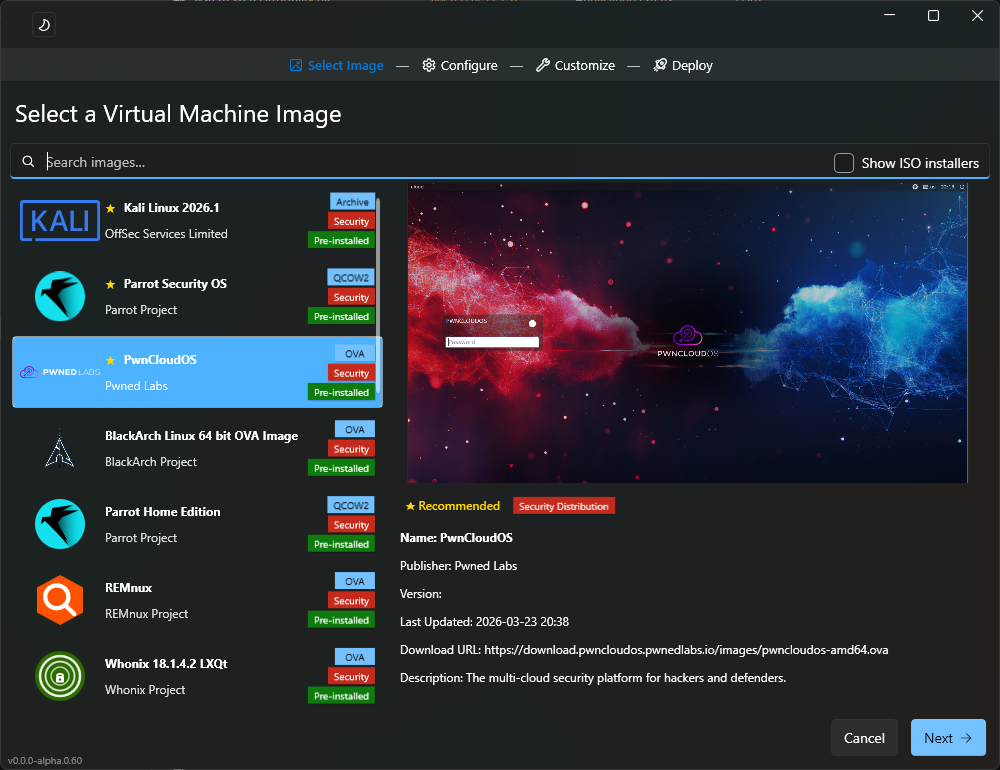

# VMCreate



A Windows desktop application that replaces Hyper-V Quick Create with a streamlined workflow for deploying security and penetration testing virtual machines — select a distribution, click Create, and VMCreate handles the download, extraction, disk conversion, and VM provisioning automatically.

## Features

- **One-click VM creation** — select a distribution, click Create, and VMCreate handles the download, extraction, disk conversion, VM provisioning, and post-boot customization automatically
- **Multi-format media support** — QCOW2, VMDK, VHD/VHDX, OVA, IMG, 7z, XZ, and Zstandard archives
- **Gen 1 & Gen 2 Hyper-V VMs** — automatic MBR-to-GPT migration and cloning for Gen 2 UEFI boot
- **Post-boot customization** — SSH-based guest automation for timezone sync, VPN deployment, and Enhanced Session setup (xRDP)
- **Hack The Box integration** — deploy OpenVPN configs from HTB Labs, Starting Point, and Academy directly into the guest
- **SHA-256 checksum verification** on all downloads
- **Phase-card progress UI** — real-time status for each stage of the deployment pipeline

## One-Click Distributions

These distributions ship disk images and can be deployed without manual installation:

| Security | General |
|----------|---------|
| BlackArch | Arch Linux |
| Kali Linux | Ubuntu |
| Parrot OS | |
| PwnCloud OS | |
| REMnux | |
| Whonix | |

Additional ISO-based distributions (Alpine, CAINE, Debian, Fedora, Linux Mint, NixOS, openSUSE, Pentoo, Rocky Linux, Security Onion, Tsurugi) are available but hidden by default as they require manual OS installation. Custom images can also be loaded from the Microsoft gallery, local JSON files, or registry entries.

## Security & Privacy Notice

VMCreate's goal is to run Linux VM disk images directly in Hyper-V — without installing VirtualBox, VMware, or any other third-party hypervisor on your Windows machine. To make this work, the conversion process modifies network configuration, firewall rules, SSH settings, and boot infrastructure inside the guest. VMCreate does its best to restore distribution defaults after customization completes.

**If you depend on the security or privacy features of a distribution, do not use VMCreate to deploy it.** The modifications made during conversion may weaken or bypass the protections those distributions are designed to provide.

Many of these distributions were not designed or tested by their creators to run in Hyper-V. Running them in this way may void any warranty or support provided by the distribution maintainers.

## Requirements

- Windows 10/11 with Hyper-V enabled
- .NET 8.0 (bundled with the self-contained build)

## Installation

Download the latest release from [GitHub Releases](../../releases):

- **MSI installer** — per-machine install that replaces the built-in Hyper-V Quick Create and restores it on uninstall
- **Standalone EXE** — self-contained portable executable, no installation required

Both builds include SHA-256 checksums for verification.

## Building from Source

```
dotnet build VMCreate.sln
dotnet test VMCreate.sln
dotnet publish VMCreate/VMCreate.csproj -c Release -r win-x64 --self-contained
```

## Documentation

- [DEPLOYMENT.md](DEPLOYMENT.md) — technical architecture, phase pipeline, KVP delivery, and progress reporting
- [SECURITY.md](SECURITY.md) — guest-to-host attack surface analysis, Hyper-V integration service hardening, and comparison with VMware/Proxmox

## License

[MIT](LICENSE.txt)